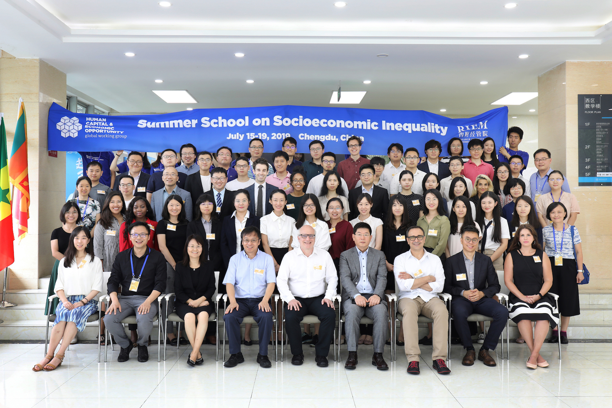

<!--

    

        <ul class="nav">
            <li><a href="#current">current courses</a></li>
            <li><a href="#shortcourses">short courses</a></li>
            <li><a href="#misc">misc lectures</a></li>
            <li><a href="#old">former courses</a></li>
        </ul>
    

 -->
##  SSSI Chengdu 2019

  
  
The <a href="https://hceconomics.uchicago.edu" target="_blank"> Human Capital and Economic Opportunity Global Working Group (HCEO)</a> at the University of Chicago and the <a href="https://riem.swufe.edu.cn" target="_blank"> Research Institute of Economics and Management (RIEM)</a> at Southwestern University of Finance and Economics (SWUFE) co-organized the HCEO's famous Summer School on Socioeconomic Inequality (SSSI) in Chengdu, China from July 15-19, 2019.

  
  
HCEO-RIEM SSSI Chengdu provides a state-of-the-art overview on the study of inequality and human flourishing. Participants will learn about the integration between psychological and sociological insights into the foundations of human behavior and conventional economic models. Through rigorous lectures, students will be trained on various tools needed to study the issue of inequality.

  
During these intense programs, students attend lectures, engage in discussions with leading faculty from around the world, present their own research, and interact with peers from institutions across the globe. 

  
To date, SSSI has been held in the U.S. (Chicago, 2012, 2013, 2015, 2016, 2017, 2018), UK (Cambridge, 2014), Russia (Moscow, 2017), Germany (Bonn, 2016, 2018), China (Beijing, 2013, 2014, 2015, and Guangzhou, 2016, 2017).
 

  
For more information please visit HCEO's official website <a href="https://hceconomics.uchicago.edu/events/summer-school-socioeconomic-inequality-chengdu-sssi-2019-chengdu" target="_blank"> Summer School on Socioeconomic Inequality, Chengdu (SSSI 2019 Chengdu)</a>.

